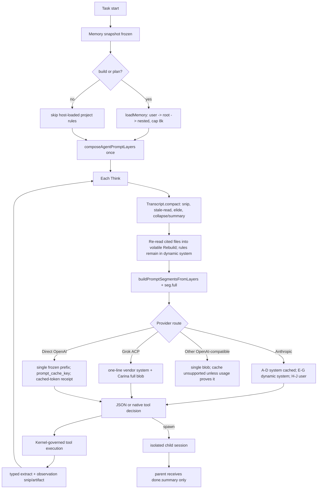

# Carina Context Engineering

Status: `v0.9.3` release specification. The core cascade, checkpoint lifecycle,
cache SLO instrumentation, and deterministic long-session fidelity fixtures are
hardened. Provider-backed cache runs and semantic quality curves remain release
evidence.

## 1. Two ledgers, one model projection

The session event log is the source of truth. The transcript is a bounded,
reconstructable projection for the model.

| Ledger | Contract |
|---|---|
| Audit/event ledger | hash chained, complete, never compacted, includes original tool bytes or artifact references |
| Model view | `Transcript`, bounded by the model window and reserve; safe to elide, summarize, and rebuild |

Raw tool output and child transcripts never enter the model view or a parent
context. Every projection transform records a receipt with preimage hash,
source reference, transform, byte/token counts, and pressure before/after.

## 2. Current cascade and target cascade

Carina implements tiers 0-5. Tier 5 uses deterministic lexical boundaries and
measured growth forecasting; embedding quality remains a later optimization.

| Tier | Current `v0.8.42` behavior | Keep | Release target |
|---|---|---|---|
| 0 enqueue snip | `snipObservation`, default 2,000 chars; typed importance + shape summary; pinned values over 64 KiB become a pinned artifact pointer | preview, hash, artifact pointer | richer provider-aware extractors |
| 1 stale-read elision | `supersedeStaleReads` removes older unpinned reads of the same path | newest read and pinned failures | retain latest relevant evidence by topic, not path only |
| 2 local collapse | keep three recent turns; elide old observations; deterministic action skeleton at pressure <= 1.10 | task, user steering, paths, and up to four explicitly requested `KEY=VALUE` read facts | add image replacement |
| 3 summary | model summary after escalation plus a bounded deterministic durable-fact ledger | user-authored turns under 4,000 chars, requested read facts, changed paths, and failures | fact confidence and richer provenance |
| 4 rebuild | re-read at most five cited/key files into volatile `Transcript.Rebuild`, 8,000 char cap; project rules stay in the freshly composed dynamic system layer | current file contents; exactly one active rule revision | verify citations and invalidate stale rebuild entries |
| 5 proactive/semantic | production policy enables lookahead, measured input-growth forecasting, and semantic boundaries; receipts record `hard_budget`, `proactive_lookahead`, `proactive_forecast`, or `semantic_shift` | bounded forecast and durable user turns | embedding/topic inference and richer fact segmentation |

The context engine package is intentionally a no-op identity today:
`go/contextengine/contextengine.go:3-4,125-171` reports that it transforms no
bytes. `Transcript.compact` is the product compressor and must remain named as
such in operator-facing output.

Compaction triggers at approximately 80% of the usable window (`window -
reserve`), with an additional lookahead reserve and EWMA growth forecast
derived from measured provider input sizes. It also retries on provider
prompt-too-long errors. Semantic compaction recognizes explicit
steering/import/fork boundaries and low-overlap topic shifts using a
deterministic lexical signal; embeddings remain a measured follow-up rather
than an ungrounded host classifier.

Every context-changing call returns a receipt. A v4 receipt represents
Step-1-only elision: no turns were folded, `Summary` is unchanged,
`removed_turns=0`, and `elided_turn_indices` plus the preimage hash identify the
exact transformed observations. The daemon persists that receipt through
`ContextCompacted` even when elision alone returns below the pressure trigger.

## 3. Token budget model

```text
window   = catalog context limit, or explicit 32,000 fallback when unknown
reserve  = max(4,000, min(32,000, window / 10))
trigger  = 0.80 * (window - reserve)
pressure = observed provider input tokens / trigger
           or chars(model_view) / 4 / trigger when usage is estimated
warning  = pressure >= 0.80
critical = pressure >= 0.90
```

`go/daemon/compaction_budget.go:24-32` computes the budget and
`context_summary.go:36-128,154-249` exposes it. Provider usage is preferred;
`chars/4` is explicitly labeled as an estimate. `/context` now reports native
schema share against the model window and computes a provider-evidence cache
SLO from canonical receipts. Layer token counts remain estimates, and no
persistent tokenizer snapshot is attached to a checkpoint.

## 4. Memory lifecycle

| Memory stream | Current injection | Budget/guard | Required lifecycle |
|---|---|---|---|
| User/project rules | `loadMemory` plus `discoverInstructionManifest` in `go/daemon/memory.go`; user home then project root to cwd; one winner per directory | 8,000-char source cap; `CARINA.override.md` > `CARINA.md` > `AGENTS.*`; checkpoint stores path/bytes/SHA-256/digest | compare the manifest on compact/resume; recompose the current effective rules once in the dynamic system layer and invalidate stale transcript rebuilds |
| Governed local memory | `memoryStore.snapshotForPrompt` in `go/daemon/memory_store.go`; frozen at task start and checkpointed, with lexical relevance ordering plus recent fallback | store limits (4,000 memory / 2,400 user by default); 6,000-byte model-view budget | inject once per run after cache boundary; never dump raw turns |
| Fresh HMS evidence | `buildTaskMemoryEvidence` in `memory_task_context.go:11-74`; pinned observation on a fresh task | normalized result cap, 768 chars per item, overall memory budget | hybrid recall only at task start, record policy/audit status, do not re-query after compact |
| Explicit memory search | lexical/semantic/auto in `memory_semantic.go:31-114` | caller limit up to 50; task snapshot has a hard byte budget | add provider-aware reranking and per-turn recall only when cache impact is measured |

Project rule loading is mode-gated: `build` and `plan` load F; `converse` and
`explore` do not host-load it. The checkpointed instruction manifest records
ordered paths, byte sizes, hashes, and an aggregate digest; compact/resume
compares that revision before the next model call.

## 5. Subagent context contract

- Child sessions are created with an attenuated capability profile and an
  independent transcript (`subagent.go:45-49,410-565`).
- Parent context receives only `done.summary`; child transcript and raw tool
  output are not copied back.
- Explore is read-only, lean, and does not load project rules
  (`explore.go:12-33,126-163`).
- Child memory is a frozen snapshot for that child; it does not inherit the
  parent transcript.
- Delegation depth and turns are bounded; parallel fan-out is explicit.

Ordinary and explore subagents now use named Mode/Identity/Intent/Protocol/Tools
sections. Their child transcript remains isolated and only `done.summary`
crosses back to the parent; tool visibility uses the same session projection as
native schemas.

## 6. `v0.9.3` prompt/context data flow



Known residual risk points are explicit: Grok and CLI routes remain uncached;
OpenAI-compatible relays are marked unsupported; and semantic inference is
deterministic lexical rather than embedding-based. Direct OpenAI uses a stable
cache key on streaming and non-streaming paths. Native HTTP schemas and the
text index share the session/mode projection, stable serialization is memoized,
and project-rule precedence is persisted as a revisioned manifest.

## 7. P0 work required before release

P0 means measurable product impact and must be completed before calling the
prompt/context system SOTA or publishing a release.

| ID | Problem | Reference implementation | Suggested Carina files | Acceptance |
|---|---|---|---|---|
| P0-1 | Stable/dynamic boundary was represented but serialized on every turn | Claude `09-system-prompt工程.md` and `04-Agent协调/06-Fork与提示词缓存优化.md` | `go/daemon/promptcache.go`, `go/daemon/reasoner.go`, route telemetry | **implemented:** memoized stable prefix, exact Anthropic A-D receipt boundary, Direct OpenAI key on both request paths, warm-up-adjusted 95% SLO with 20-request minimum |
| P0-2 | Native HTTP sent all builtin schemas without the active authority projection | Claude tool loading and OMP session-tools deferred exposure | `go/daemon/tool_registry.go`, `go/daemon/tool_schema.go`, `go/daemon/agent.go` | **implemented:** native schemas and text catalog use the same session/mode projection; 32k schema-share fixture enforces <15% |
| P0-3 | Pinned observations could bypass the model-view budget | Claude context compression cascade; OMP compaction | `go/daemon/transcript.go`, `context_compression.go`, artifact store | **implemented:** ordinary cap plus pinned >64 KiB recoverable artifact pointer and hash |
| P0-4 | Compaction lacked proactive lookahead, semantic boundaries, and receipts for cheap-only transforms | jcode `compaction.rs`; OMP `docs/compaction.md` | `go/daemon/transcript.go`, `compaction_budget.go`, `compact_rebuild.go` | **implemented:** lookahead, EWMA forecast, lexical topic boundaries, v4 elision-only receipts, bounded requested-evidence facts, and checkpoint-roundtrip 60+/72-turn fidelity fixtures |
| P0-5 | Rule lifecycle lacked durable source revisions | Codex `agents_md.rs`/manager and Claude layered CLAUDE.md | `go/daemon/memory.go`, `compact_rebuild.go`, checkpoint schema | **implemented:** deterministic path/bytes/SHA-256 manifest persisted and compared on compact/resume |

## 8. P1 and P2

| Priority | Item | Completion signal |
|---|---|---|
| P1 implemented | EWMA proactive compaction and expected-output reservation | receipts distinguish lookahead, forecast, semantic shift, and hard budget |
| P1 baseline | Semantic/topic-shift compaction with deterministic durable facts | 60-turn fixture preserves task, steering, changed path, failure, and next action; 72-turn fixture preserves explicit first/middle/last read evidence across checkpoint restore |
| P1 | Memory retrieval budget and reranking | task memory snapshot has a hard byte cap and relevance-first ordering; per-turn recall remains opt-in |
| P1 implemented | Strict subagent prompt sections | child A-D uses named sections and a frozen prefix; parent receives summary-only output |
| P1 implemented | Provider cache dashboard | `/context` reports actual boundary hash, provider evidence, post-warm-up hit rate, sample sufficiency, and SLO verdict |
| P2 | Provider tokenizer snapshots | pressure error below 5% for supported routes |
| P2 | Automatic degradation ladder | tool schema reduction, memory suppression, and new-session suggestion are deterministic at critical pressure |
| P2 | Context replay/quality harness | 50+ turn fixtures produce success-vs-pressure curves and compact fidelity reports |

## 9. Anti-patterns

1. Compacting the audit chain or treating a model summary as the source of
   truth.
2. Putting TASK, transcript, or project rules into the cacheable A-D prefix.
3. Calling `contextengine` a compressor while its effective engine is no-op.
4. Sending every native/MCP schema or skill body every turn.
5. Re-reading or re-injecting project rules into a greeting merely because a
   compact happened.
6. Returning child transcripts to the parent.
7. Using more `DO NOT` rules to mask a wrong role, mode, or tool boundary.
8. Claiming cache hits without provider `cache_read` evidence.
9. Treating a successful answer as proof of context health.
