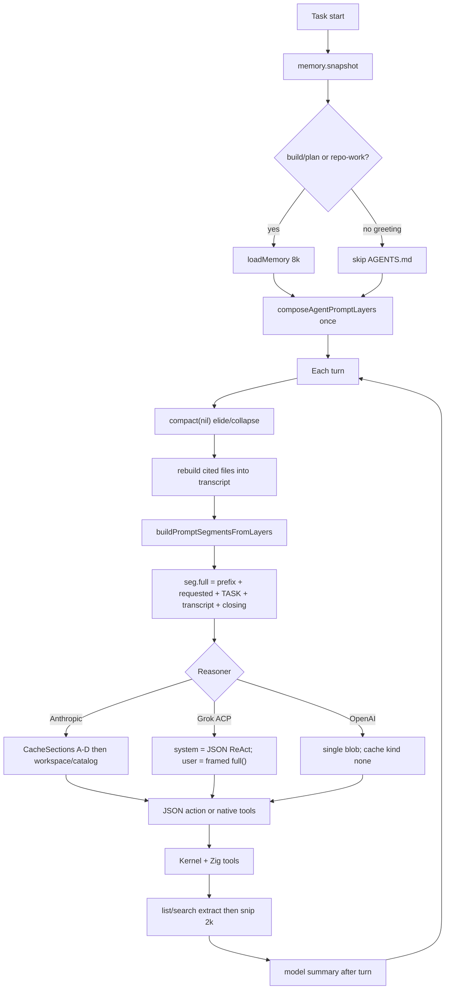

# Carina Context Engineering (DRAFT LAW)

> Companion to `docs/PROMPT_SPEC.md`. Code: `go/daemon/transcript.go`,
> `compaction_budget.go`, `memory.go`, `memory_store.go`, `subagent.go`,
> `explore.go`, `context_summary.go`, `go/contextengine` (noop).

---

## 1. Two ledgers

| Ledger | Owner | Bound |
|--------|-------|-------|
| Audit / events | hash chain | complete, never compacted |
| Model view | `Transcript` | window − reserve; snip → elide → summary |

Never feed the audit log to the model.

---

## 2. Compaction cascade (target)

Keep today’s cheap-first order. Add the missing outer tiers later.

| Tier | When | Keep | Drop |
|------|------|------|------|
| 0 Snip | enqueue | last 2k chars of a tool obs (pinned fail-closed) | raw tail |
| 1 Stale reads | newer read of same path | latest | older unpinned reads |
| 2 Elide | pressure ≤ ~1.10 | last `KeepRecent` (3) turns; user turns under 4k | old tool bodies → pointer |
| 3 Summary | pressure above local tier | 9-class handoff (user verbatim, paths, errors, next) | folded tool process |
| 4 Rebuild | after 3 | **re-read** ≤5 cited files into volatile `Transcript.Rebuild` (8k char cap) | stale citations |
| 5 Proactive / semantic | P1 | EWMA lookahead / topic shift | — |

Today: 0–4 exist. 5 does not. Rebuild is volatile (with TASK), never prefix.
F stays in Workspace for build/plan for the run — do not dump AGENTS.md into
a greeting because compact ran. `go/contextengine` is identity; do not
advertise it as a compressor.

Trigger: ~80% of (catalog window − reserve). Fallback window 32k is honest
only when the catalog has no window — do not silently use 32k for a 200k model.

After compact: constitution A–D unchanged. F/G stay in the frozen Workspace
prefix for build/plan. Cited files that were folded are re-read into
`Transcript.Rebuild` (volatile). Greeting turns still must not load F.

---

## 3. Token budget (operator-visible)

```
window     = catalog context or declared fallback
reserve    = max(4k, min(32k, window/10))
trigger    = 80% × (window − reserve)
pressure   = observed_input_tokens / trigger
             (chars/4 of the model view when usage is absent or estimated)
warning    = 80%    critical = 90%
```

Provider-reported input tokens drive model-view pressure and `/context`
ledger counts when the last usage is not an estimate. `len/4` stays the
fallback.

TUI `/context` already speaks VOICE. Do not show `ledger`/`hash` slang.
In-loop `tr.compact` and idle `/compact` must be labeled as different
jobs (live model view vs checkpoint rewrite).

---

## 4. Memory inject

| Stream | When | Budget | Where |
|--------|------|--------|-------|
| Project rules (F) | build/plan or repo-work heuristic | 8k chars, one winner per directory | Workspace layer |
| Governed snapshot (G) | task start, frozen | existing store cap | Workspace layer |
| HMS evidence | fresh task, hybrid mode | pinned observation | Transcript, not system |

Do not retrieve HMS or dump AGENTS.md for Fixture G.

---

## 5. Subagent contract (keep)

- Child: own session, attenuated profile, own transcript.
- Explore: no project rules, no writes, lean tools.
- Parent sees **only** `done.summary`.
- Do not copy parent TRANSCRIPT into the child.
- Do not copy child TRANSCRIPT into the parent.

---

## 6. Pipeline (as shipped)



**P0 landed (0.8.31–0.8.34 + S8 + S7 + S10 + S11 + T-S1 + T-S2 + T-S3 + C1 + C2):** converse default, F mode-gated (not a phrase
classifier), TASK out of prefix, Grok ReAct envelope, compact summarizer off
the Think stack, capability brief out of live constitution, one-line builtins
with protocol C ≤ 5 (constitution without F < 800 tok), named A–D sections with
Anthropic `cache_control` per section, REQUESTED skills out of Catalog, native
envelope ≤ 200 B without re-pasting `toolsHelp`, `web.search` (host approval,
untrusted), real `todo`/`update_plan` dispatch, search/list structured extract,
Fixture G/R first-3-turn constitution without F < 800 tok, `go/contextengine`
identity (Transcript.compact is the product compressor).
Remaining waste is P1 (`full()` rebuild, EWMA compact, 奏折) and P2 — not unmarked P0.

---

## 7. P0 / P1 / P2

**P0** (prompt law `PROMPT_SPEC.md` S1–S11, tool-surface T-S1–T-S3 + S10, context-engineering C1–C2) is closed:

| ID | Item |
|----|------|
| T-S1 | **Landed:** `web.search` — public query after host approval; same NetworkAccess/HTTPS/SSRF/untrusted/fail-closed as `web.fetch`; plan+explore blocked; dispatch + native schema. |
| T-S2 | **Landed:** `todo` / `update_plan` — real session checklist (dispatch + schema). Plan mode allowed; explore not. Not a phrase classifier. |
| T-S3 | **Landed:** search groups by file (count + first line); list rolls up dirs + sample files. |
| S10 | **Landed:** REQUESTED skills out of Catalog; `CacheSections` independent of greeting wording. |
| S11 | **Landed:** native envelope ≤ 200 B; `withToolContract` does not re-paste `toolsHelp`. |
| P0-C1 | **Landed:** Fixture G (`hi`) and Fixture R (repo-work converse) measure constitution on the live compose path for the first 3 turns; without Workspace/F it stays < 800 tok (`len/4`). |
| P0-C2 | **Landed:** `go/contextengine` is identity/noop. In-loop compact is `Transcript.compact`, not a context engine. |

**P1** (deferred)

| ID | Item |
|----|------|
| P1-C1 | **Landed:** post-compact re-read of ≤5 cited files into volatile Rebuild (8k cap, kernel FileRead). F is not dumped on converse/greetings. |
| P1-C2 | **Landed:** provider usage drives model-view pressure and `/context` ledger when present; `len/4` is fallback when usage is absent or estimated. |
| P1-C3 | Proactive compact (jcode EWMA) before hard 80% — deferred |
| P1-C4 | **Landed:** search groups by file (count + first line); list rolls up dirs + sample files. Raw grep/tree is not the observation. |

**P2**

| ID | Item |
|----|------|
| P2-C1 | Semantic / topic-shift compact |
| P2-C2 | Memory retrieve budget per turn (jcode N→N+1) |
| P2-C3 | Tokenizer-accurate pressure in `/context` |

---

## 8. Anti-patterns

1. Do not compact the audit chain.
2. Do not fold user messages away without the verbatim budget.
3. Do not re-inject AGENTS.md into a greeting turn “because compact dropped it”.
4. Do not enable MiniLM / snapcompact as a default to look like OMP/jcode.
5. Do not return child transcripts to the parent.
6. Do not treat idle `/compact` as a substitute for in-loop `tr.compact`.
7. Do not call `Transcript.compact` a context engine; `go/contextengine` is identity until it is not.
