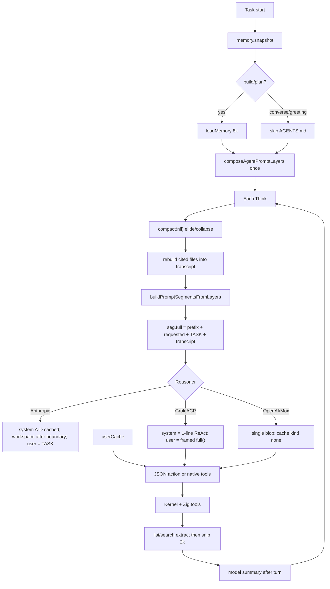

# Carina Context Engineering (DRAFT LAW)

> Companion to `docs/PROMPT_SPEC.md`. Product still FAIL while constitution
> rides in the user role and default models are cache `none`.
> Evidence: `docs/research/competitive-2026-08/27-prompt-context-audit-0.8.41.md`.
> Code: `go/daemon/transcript.go`, `compaction_budget.go`, `compact_rebuild.go`,
> `memory.go`, `subagent.go`, `context_summary.go`, `anthropic.go`,
> `go/contextengine` (noop).

---

## 1. Two ledgers

| Ledger | Owner | Bound |
|--------|-------|-------|
| Audit / events | hash chain | complete, never compacted |
| Model view | `Transcript` | window − reserve; snip → elide → summary |

Never feed the audit log to the model.

---

## 2. Compaction cascade

Keep today’s cheap-first order. Outer tiers stay P1.

| Tier | When | Keep | Drop |
|------|------|------|------|
| 0 Snip | enqueue | last 2k chars of a tool obs (pinned fail-closed) | raw tail |
| 1 Stale reads | newer read of same path | latest | older unpinned reads |
| 2 Elide | pressure ≤ ~1.10 | last `KeepRecent` (3) turns; user turns under 4k | old tool bodies → pointer |
| 3 Summary | pressure above local tier | 9-class handoff (user verbatim, paths, errors, next) | folded tool process |
| 4 Rebuild | after 3 | **re-read** ≤5 cited files into volatile `Transcript.Rebuild` (8k char cap) | stale citations |
| 5 Proactive / semantic | P1 | EWMA lookahead / topic shift | — |

Today: 0–4 exist. 5 does not. Rebuild is volatile (with TASK), never prefix.
F stays in Workspace for build/plan for the run — do not dump AGENTS.md into
a greeting because compact ran. After compact on build/plan, Grok-style
verbatim AGENTS **item** is P1-C5, not a greeting splice.

`go/contextengine` is identity; do not advertise it as a compressor.
`Transcript.compact` is the product compressor.

Trigger: ~80% of (catalog window − reserve). Fallback window 32k is honest
only when the catalog has no window — do not silently use 32k for a 200k model.
Proxy model ids alias through the lab catalog (same path as vision chips).

---

## 3. Token budget (operator-visible)

```
window     = catalog context or declared fallback
reserve    = max(4k, min(32k, window/10))
trigger    = 80% × (window − reserve)
pressure   = observed_input_tokens / trigger
             (chars/4 of the model view when usage is absent or estimated)
warning    = 80%    critical = 90%
```

Provider-reported input tokens drive model-view pressure and `/context`
ledger counts when the last usage is not an estimate. `len/4` stays the
fallback.

Anthropic `/context` must show `cache_read` vs `cache_write` (P0-P14).
Grok/OpenAI must show `cache=none` without implying prefix cache.

TUI `/context` already speaks VOICE. Do not show `ledger`/`hash` slang.
In-loop `tr.compact` and idle `/compact` must be labeled as different
jobs (live model view vs checkpoint rewrite).

---

## 4. Memory inject

| Stream | When | Budget | Where |
|--------|------|--------|-------|
| Project rules (F) | build/plan only | 8k chars, one winner per directory | Workspace layer, after cache boundary |
| Governed snapshot (G) | task start, frozen | existing store cap | Workspace layer |
| HMS evidence | fresh task, hybrid mode | pinned observation | Transcript, not system |

Do not retrieve HMS or dump AGENTS.md for Fixture G.
Identity and F are not a substitute for inspecting this repository.

---

## 5. Subagent contract (keep)

- Child: own session, attenuated profile, own transcript.
- Explore: no project rules, no writes, lean tools.
- Parent sees **only** `done.summary`.
- Do not copy parent TRANSCRIPT into the child.
- Do not copy child TRANSCRIPT into the parent.

---

## 6. Pipeline (as shipped 0.8.41 — waste marked)



**Target after P0-P12:** Anthropic `system` = A–D (cached). User = H–J.
Workspace/F/G sit after the dynamic boundary, not in TASK.

---

## 7. P0 / P1 / P2

Prompt-law structure S1–S11 and tool-surface T-S1–T-S3 remain landed.
Context-engineering C1–C2 (constitution < 800 tok on G/R; contextengine
identity) remain landed. **Product P0 is not closed.**

| ID | Status | Item |
|----|--------|------|
| P0-P12 | **source** | Anthropic `system` A–D + dynamic workspace. Grok/OpenAI still user-stuffed |
| P0-P13 | **source** | Intent: identity/F are not this repository |
| P0-P14 | **source** | `/context` `constitution_role` + `cache_read_tokens` in usage breakdown |
| P0-C1 | landed | Fixture G/R constitution without F < 800 tok |
| P0-C2 | landed | `go/contextengine` is identity |
| P1-C1 | landed | post-compact cited-file rebuild (volatile) |
| P1-C2 | landed | provider usage drives pressure when present |
| P1-C5 | open | AGENTS.md item after compact, build/plan only |
| P1-C3 | deferred | Proactive compact (jcode EWMA) |
| P1-C6 | deferred | OpenAI prefix cache only if the route documents it |
| P2-C1 | deferred | Semantic / topic-shift compact |
| P2-C2 | deferred | Memory retrieve budget per turn |
| P2-C3 | deferred | Tokenizer-accurate pressure in `/context` |

Do not enable MiniLM / snapcompact as defaults to look like jcode/OMP.

---

## 8. Anti-patterns

1. Do not compact the audit chain.
2. Do not fold user messages away without the verbatim budget.
3. Do not re-inject AGENTS.md into a greeting turn “because compact dropped it”.
4. Do not enable MiniLM / snapcompact as a default.
5. Do not return child transcripts to the parent.
6. Do not treat idle `/compact` as a substitute for in-loop `tr.compact`.
7. Do not call `Transcript.compact` a context engine.
8. Do not treat user-block `cache_control` as a system cache boundary.
9. Do not answer workspace structure from product identity.
