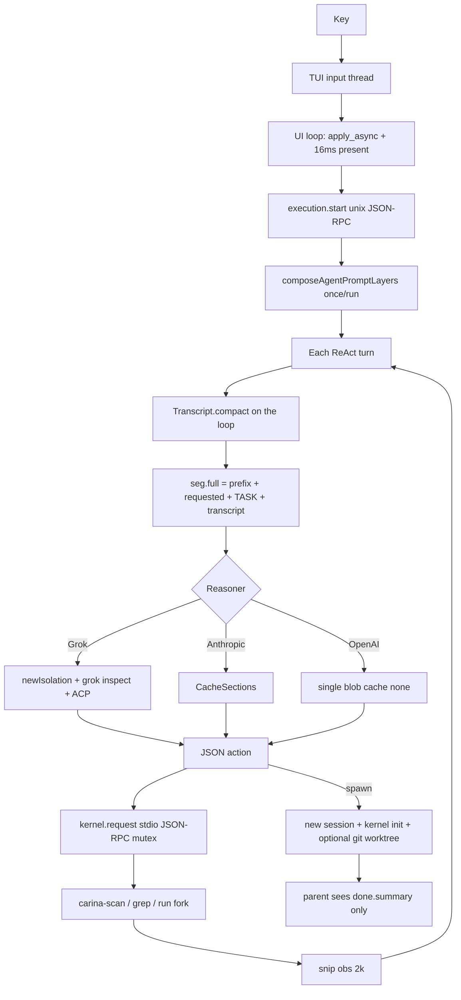

# Carina Hot Path (DRAFT LAW)

> Status: **P0 H1–H7 shipped in v0.8.33**. Live evidence:
> `docs/research/competitive-2026-08/20-hot-path-latency-audit.md`.
> Code: `go/daemon/agent.go`, `promptcache.go`, `subagent.go`, `grok_reasoner.go`,
> `go/kernel/kernel.go`, `go/rpc/client.go`, `zig/carina-scan`,
> `crates/carina-tui/src/app/mod.rs`, `frame_scheduler.rs`.
>
> “The task completed” is not a pass. Snappiness is the product.

Steal jobs, not pixels. Do not copy Grok pager, jcode jemalloc, or OMP N-API
into Carina identity. Hash-chained audit and fail-closed kernel stay.

---

## 1. Live pipeline (as shipped v0.8.33)

---

## 2. What is already not the bottleneck

These are **not** P0 lies. Do not “fix” them by copying a competitor.

| Path | Fact |
|------|------|
| Input vs stream | Dedicated `terminal-input` thread; UI waits on `async_rx` (`app/mod.rs` `run`) |
| Draw cadence | Event-driven + `DEFAULT_MIN_DRAW_INTERVAL` 16ms; animation ticks only with `TickDemand` |
| Subagent return | Parent gets `done.summary` only (`subagent.go`) |
| Explore spawn | `read-only` → no git worktree |
| Tool batch (declared) | `list`/`read`/`search` fan-out in goroutines (`executeBatch`) |
| Workflow ready set | Independent steps `go` in parallel (`workflow.go`) |
| MCP schemas | Index + `mcp_find`; not full schema every turn |
| Stream deltas | `assistant.message.delta` exists (`reasoner_stream_test.go`) |
| TASK vs cache | TASK is volatile (0.8.31) |
| Scan ignore | `target`/`.git`/`Library` are not descended (0.8.32) |

---

## 3. Blocking points that *are* the product

| ID | Block | Magnitude (this audit) | Pattern |
|----|-------|------------------------|---------|
| H1 | Grok `Think` runs `newIsolation` + `grok inspect --json` **every turn** | extra process before TTFT; 180s think budget | 4, 14 |
| H2 | `rpc.Client.Call` holds `mu` for the whole kernel stdio round-trip | parallel batch of reads is still serial on the kernel pipe | 1 |
| H3 | `list` always `carina-scan` of the whole tree, then keeps 200 lines | 0.15–0.55s scan of this repo, then throw away the tail | 9, 12 |
| H4 | `search` always `carina-grep` fork/exec | 80ms grep of `go/daemon` in this measurement | 12 |
| H5 | `compact()` may call the **same** reasoner synchronously before `Think` | extra model round-trip on the turn | 3 |
| H6 | Every tool: kernel JSON-RPC + hash-chain event | fail-closed cost; do not remove; batch it | 10 |
| H7 | Constitution still ships full `toolsHelp` (~4.8kB / ~1.2k tok) every run | Grok/OpenAI cache kind `none` | 2 |
| H8 | `seg.full()` concatenates the prompt every turn | string rebuild, not prefix reuse in adapters except Anthropic | 2, 10 |
| H9 | No stream keepalive on long kernel/tool | UI only has 16ms/33ms ticks while a run is active | 7 |
| H10 | No PTY TTFF bench | jcode publishes 14ms / 49ms; Carina `tui_bench` is offscreen markdown p50 **37ms** | — |

---

## 4. P0 knives (snappiness)

| ID | Change | Accept |
|----|--------|--------|
| P0-H1 | Reuse Grok isolation + skip inspect after the first successful verify of that process | **landed**: persistent grokHome; turn 2+ skips `inspect` |
| P0-H2 | Parallel `read`/`list`/`search`: one workspace FileRead gate, then concurrent IO | **landed**: batch authorizes workspace once, then fans out |
| P0-H3 | `list` is a bounded tree, not a 1400-file walk truncated to 200 | **landed**: `--max-files 200 --max-depth 4` |
| P0-H4 | First conversation frame before provider inventory; PTY TTFF bench | **landed**: bootstrap skips `model.list`; first paint is conversation chrome; `tui_bench` emits `ttff_ms` / `ttfi_ms` |
| P0-H5 | Visible motion on submit | **partial**: empty agent label is `converse`; queued spinner already existed |
| P0-H6 | Compaction summarizer off the Think stack | **landed**: `compact(nil)` before Think; model summary after the turn |
| P0-H7 | Stream/tool keepalive on waits > 1s | **landed**: bus-only `execution.keepalive` (not audit) during Think and tool waits |

---

## 5. Anti-patterns

1. Do not treat goroutine fan-out as parallel if the kernel pipe is mutexed.
2. Do not `grok inspect` every JSON action.
3. Do not walk `target/` to throw the files away (fixed 0.8.32; do not regress).
4. Do not enable MiniLM / snapcompact / wholesale Grok pager to “feel faster”.
5. Do not drop hash-chained audit to win a microbench.
6. Do not load every MCP schema to avoid one `mcp_find`.
7. Do not copy child transcripts into the parent.
8. Do not busy-spin the UI loop (keep event-driven 16ms).
