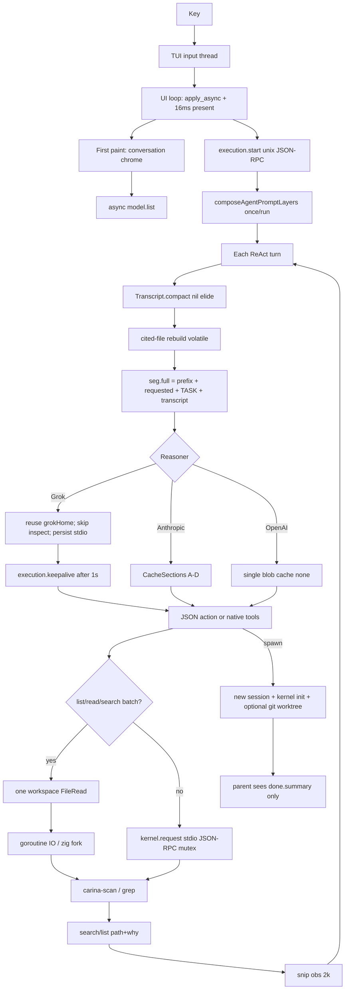

# Carina Hot Path (DRAFT LAW)

> Status: **P0 H1–H7 shipped in v0.8.33; re-measured v0.8.38; P0-H11 landed after 0.8.38**. Live evidence:
> `docs/research/competitive-2026-08/26-hot-path-post-0.8.38.md` (prior: `20`).
> Code: `go/daemon/agent.go`, `promptcache.go`, `subagent.go`, `grok_reasoner.go`,
> `go/kernel/kernel.go`, `go/rpc/client.go`, `zig/carina-scan`,
> `crates/carina-tui/src/app/mod.rs`, `frame_scheduler.rs`, `bench_harness.rs`.
>
> “The task completed” is not a pass. Snappiness is the product.
> Chrome TTFF matching jcode is not a pass if Grok still `exec`s every Think.
> P0-H11 landed: turn 2+ reuses the ACP/`stdio` child. Do not claim Grok prefix cache.

Steal jobs, not pixels. Do not copy Grok pager, jcode jemalloc, or OMP N-API
into Carina identity. Hash-chained audit and fail-closed kernel stay.

---

## 1. Live pipeline (as shipped v0.8.38)

---

## 2. What is already not the bottleneck

These are **not** P0 lies. Do not “fix” them by copying a competitor.

| Path | Fact (0.8.38 measured) |
|------|------------------------|
| First frame | PTY TTFF **15.2 ms** / TTFI **15.4 ms** (`tui_bench` `pty_first_frame`) |
| Input vs stream | Dedicated `terminal-input` thread; UI waits on `async_rx` |
| Draw cadence | Event-driven + `DEFAULT_MIN_DRAW_INTERVAL` 16ms; animation only with `TickDemand` |
| Inventory | `model.list` **after** first paint; 20×250ms poll on a background thread |
| Subagent return | Parent gets `done.summary` only |
| Explore spawn | `read-only` / `sandboxed` → no git worktree |
| Tool batch | one workspace FileRead, then `list`/`read`/`search` goroutines |
| Workflow ready set | Independent steps `go` in parallel (`workflow.go`) |
| MCP schemas | Index + `mcp_find`; not full schema every turn |
| Stream deltas | `assistant.message.delta` |
| Keepalive | bus-only `execution.keepalive` after 1s on Think and tool waits |
| TASK vs cache | TASK is volatile; REQUESTED skills are volatile (S10) |
| Scan ignore + bound | `target`/`.git` not descended; `--max-files 200 --max-depth 4` |
| Constitution | A–D under 800 tok without F; native envelope **167 B** |
| Compaction on Think | `compact(nil)` only; model summary **after** the turn |
| Tool obs | snip 2k; search/list structured extract |

---

## 3. Blocking points that *are* the product

| ID | Block | Magnitude (0.8.38) | Pattern |
|----|-------|--------------------|---------|
| H11 | Grok `Think` **reuses** one ACP/`stdio` child for the reasoner (inspect still skipped after first verify) | **landed**: turn 2+ does not `exec` a new `grok` | 14 |
| H2 | `rpc.Client.Call` holds `mu` for the whole kernel stdio round-trip | parallel **capability** calls (run/patch/spawn) still serial | 1, 11 |
| H12 | `list`/`search` still **fork** Zig tools; no per-run memo | warm scan **0–20 ms**, grep **40–60 ms**; repeat list pays again | 9, 12 |
| H6 | Every gated tool: kernel JSON-RPC + hash-chain event | fail-closed cost; do not remove; batch envelopes | 10 |
| H8 | `seg.full()` concatenates every turn; Grok cache kind `none` | string rebuild; honest uncached ACP | 2, 10 |
| H4-spawn | Subagent = new session + `InitSessionFull` + optional worktree | parent `wg.Wait()`; summary-only is not the tax | 4, 14 |

H1 (inspect every turn), H3 (1400-file list), H5 (summarizer on Think), H7 (4.8kB toolsHelp), H9 (no keepalive), H10 (no PTY bench), H11 (re-exec grok every Think) are **closed**.

---

## 4. P0 knives (snappiness)

| ID | Change | Accept |
|----|--------|--------|
| P0-H1 | Reuse Grok isolation + skip inspect after first verify | **landed** |
| P0-H2 | Parallel `read`/`list`/`search`: one workspace FileRead, then concurrent IO | **landed** |
| P0-H3 | `list` bounded `--max-files 200 --max-depth 4` | **landed** |
| P0-H4 | First conversation frame before inventory; PTY TTFF bench | **landed**: TTFF **15.2 ms** |
| P0-H5 | Visible motion on submit | **partial** |
| P0-H6 | Compaction summarizer off the Think stack | **landed** |
| P0-H7 | Stream/tool keepalive on waits > 1s | **landed** |
| **P0-H11** | Persist Grok ACP/`stdio` process for the **run**, not only `grokHome` | **landed**: Turn 2+ does not `exec` a new `grok` |
| **P0-H12** | Memo last bounded scan / grep `(root, pattern)` for the run; invalidate on patch/edit | Second `list` does not spawn `carina-scan` |

---

## 5. Anti-patterns

1. Do not treat goroutine fan-out as parallel if the kernel pipe is mutexed.
2. Do not `grok inspect` every JSON action. Do not **re-exec grok** every JSON action either.
3. Do not walk `target/` to throw the files away (fixed 0.8.32; do not regress).
4. Do not enable MiniLM / snapcompact / wholesale Grok pager to “feel faster”.
5. Do not drop hash-chained audit to win a microbench.
6. Do not load every MCP schema to avoid one `mcp_find`.
7. Do not copy child transcripts into the parent.
8. Do not busy-spin the UI loop (keep event-driven 16ms).
9. Do not claim Anthropic-style prefix cache on Grok `full()`.
10. Do not treat “we have spawn” as snappy if every child `InitSessionFull` + worktree.
